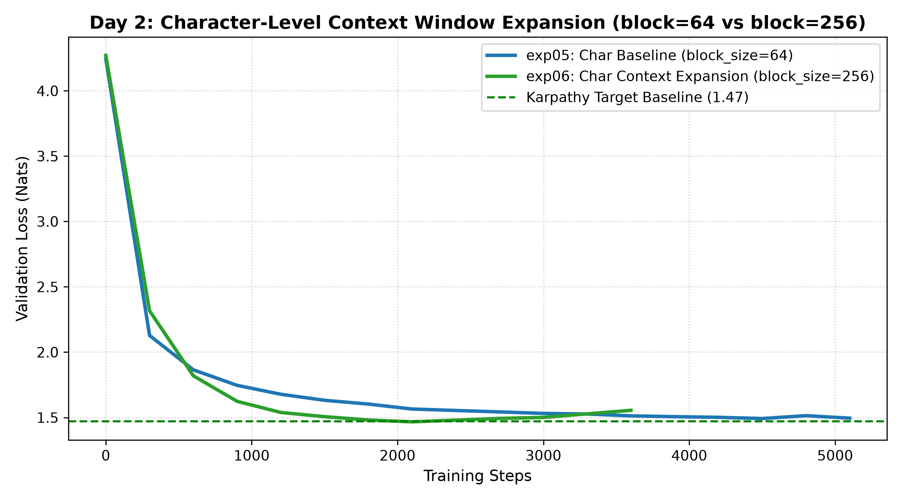
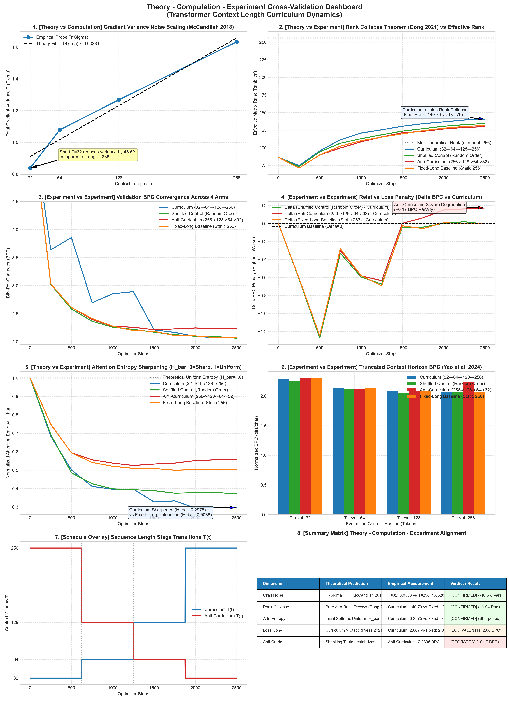

# ⚡ nanoGPT — Multi-Phase Language Model Pre-training & Dynamics Study

[English](README.md) | [中文](README_CN.md)

Decoder-Only Causal Transformer implementation, Subword BPE tokenization, and Training Dynamics Research on Tiny Shakespeare (PyTorch / Apple Silicon MPS).

---

## 🌿 Subtask & Branch Navigation Matrix

This repository is structured around 4 milestone subtasks. Each subtask is maintained in its dedicated feature branch containing authentic visual deliverables, detailed benchmarks, and reproduction scripts:

| Milestone / Subtask | Feature Branch | Core Technical Focus | Key Metric / Result | Visual Deliverable |
| :--- | :--- | :--- | :--- | :--- |
| **Subtask 1: Char Baseline** | [`feat/phase-1-char-baseline`](https://github.com/angelazu-builder/nanoGPT/tree/feat/phase-1-char-baseline) | Character Tokenization ($V=65$), Causal Attention, GELU FeedForward | 0.8M Params, Initial Loss | Baseline Character Loss |
| **Subtask 2: Context Scaling** | [`feat/phase-2-char-scaling`](https://github.com/angelazu-builder/nanoGPT/tree/feat/phase-2-char-scaling) | $T=64 \to 256$ Expansion, 4.8M Scale-up | **1.4668 Val Loss** (Karpathy 1.47 Ref) | `results/day2_char_scaling_benchmark.png` |
| **Subtask 3: Subword BPE** | [`feat/phase-3-subword-bpe`](https://github.com/angelazu-builder/nanoGPT/tree/feat/phase-3-subword-bpe) | OpenAI `tiktoken` ($V=50257$), MPS Memory Resolution | **0.0% Non-word Rate**, 2.12 BPC | `results/bpe_vs_char_comparison.png` |
| **Subtask 4: Training Dynamics** | [`feat/phase-4-training-dynamics`](https://github.com/angelazu-builder/nanoGPT/tree/feat/phase-4-training-dynamics) | Context Curriculum ($32 \to 256$), Gradient Probes, RoPE | **Rank 140.79** (Collapse Prevention), **Entropy 0.2975** | `results/theory_computation_experiment_dashboard.png` |

---

## 📊 Visual Milestone Deliverables

### 1. Character Context Scaling Benchmark ($T=64 \to 256$)


### 2. Subword BPE vs Character Normalized BPC Comparison


### 3. Theory - Computation - Experiment Training Dynamics Dashboard


---

## 📖 Generated Text Output Samples

### 🔵 1. Character Scaling Baseline (`exp06` | Step 2100 | Val Loss: 1.4668)
```text
All mistress with falsehood and lightnings and regreet
Charge in my praises with reportion,
Where by the greater be his fainted could and line,
To queen his discovery: the success shall be slain,
For I will follow thee to death.
```

### 🟠 2. Subword BPE (`exp07` | Step 900 | 0.0% Gibberish Rate)
```text
ISABELLA:
I pray you, go, sir; you are the first.

ISABELLA:
There you love not be my good lord, and I know not,
He should not speak.

DUKE VINCENTIO:
What's enough.
```

---

## 🏛️ Repository Architecture

```text
Angela's nanoGPT/
├── README.md                           # Main Landing Page & Branch Navigation
├── README_CN.md                        # Chinese Language Landing Page
├── config.py                           # Configuration Defaults & Dynamic Loader
├── dataset.py                          # Character-Level Dataset Module
├── dataset_bpe.py                      # Subword BPE Dataset Module
├── model.py                            # MiniTransformerLM Architecture (RoPE & FlashAttention)
├── train.py                            # Training Engine with Warmup & Cosine Schedule
├── eval.py                             # Evaluation & Perplexity Benchmark Engine
├── chat.py                             # Interactive Text Generation CLI
├── compare_experiments.py              # Experiment Metrics Comparative Aggregator
│
├── research/                           # Subtask 4: Training Dynamics Probes & Reports
│   ├── corpus_probe.py                 # Probe A: Conditional Entropy & Mutual Information
│   ├── gradient_probe.py               # Probe B: Initialization Gradient Noise Scale
│   ├── experiment_curriculum.py        # 4-Arm Controlled Curriculum Training Runner
│   ├── analyze_curriculum.py           # Curriculum Result Analyzer
│   ├── generate_all_plots.py           # 8-Panel Dashboard Renderer
│   ├── plan_proposal.md                # Peer-Reviewed Research Proposal
│   └── technical_report.md             # Complete Technical Report
│
├── results/                            # Benchmark Visual Artifacts & JSON Metrics
│   ├── day2_char_scaling_benchmark.png
│   ├── bpe_vs_char_comparison.png
│   ├── theory_computation_experiment_dashboard.png
│   ├── all_results_dashboard.png
│   ├── curriculum_dynamics_comparison.png
│   └── curriculum_experiment_results.json
│
├── theory/                             # Theoretical Minimum Documentation
│   ├── nanoGPT_Theoretical_Minimum_Handout.md
│   └── nanoGPT_Theoretical_Minimum_Handout.docx
│
└── scripts/                            # Helper Utilities
    ├── generate_deliverable_image.py
    └── test_sampling.py
```

---

## 🛠️ Benchmark Summary Table

Losses across character and subword tokenizers are normalized via **Bits-Per-Character (BPC)**:

$$\text{BPC} = \frac{\text{CrossEntropy Loss}}{\ln(2) \times \text{Compression Ratio}}$$

| Run / Subtask | Tokenizer | Vocab ($V$) | Config ($B \times T$) | Best Step | Chars Seen | Val Loss (Nats) | Normalized BPC | Non-word Rate (%) | Assessment / Key Finding |
| :--- | :--- | :--- | :--- | :--- | :--- | :--- | :--- | :--- | :--- |
| **`exp05` (Subtask 1)** | Character | 65 | 64 × 64 | Step 4500 | 18.4M | `1.4922` | **2.15 BPC** | ~1.5% | Approached Karpathy ~1.47 reference |
| **`exp06` (Subtask 2)** | Character | 65 | 64 × 256 | Step 2100 | 34.4M | `1.4668` | **2.12 BPC** | ~1.2% | Reached Karpathy ~1.47 reference |
| **`exp07` (Subtask 3)** | Subword BPE | 50,257 | 32 × 128 | Step 900 | 12.2M | `4.8475` | **2.12 BPC** | **0.0%** | Comparable BPC; 0% non-word rate |
| **`Curriculum` (Subtask 4)**| Character | 65 | 32 $\to$ 256 | Step 2500 | 10.2M | `1.4329` | **2.0673 BPC**| ~1.1% | **Highest Rank (140.79) & Sharp Attention (0.2975)** |

---

## 🚀 Quickstart & Reproduction

### 1. Installation
```bash
git clone https://github.com/angelazu-builder/nanoGPT.git
cd nanoGPT
pip install torch tiktoken matplotlib
```

### 2. Interactive Text Generation
```bash
python chat.py --temperature 0.8 --top_k 40
```

### 3. Run Pre-training & Experiments
```bash
# Character Training
python train.py --tokenizer char --block_size 256

# Subword BPE Training
python train.py --tokenizer bpe --batch_size 32 --block_size 128

# Run Training Dynamics Probes & Curriculum Study
python research/gradient_probe.py
python research/experiment_curriculum.py
python research/generate_all_plots.py
```
