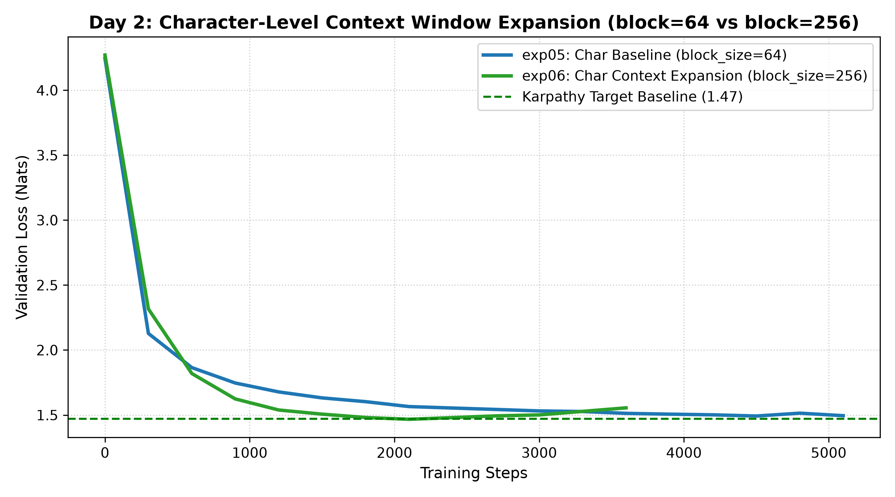
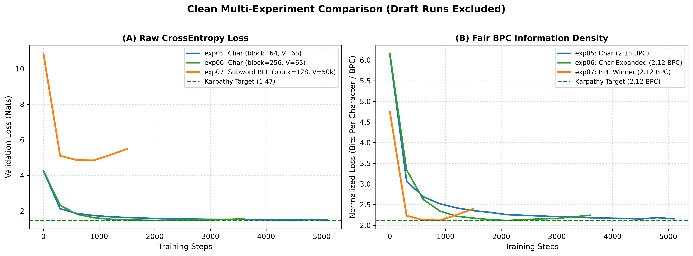
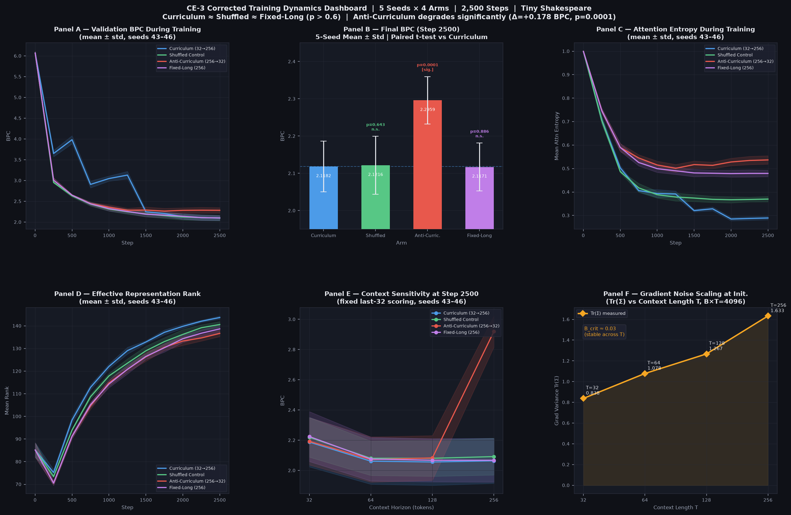

# ⚡ nanoGPT — Multi-Phase Language Model Pre-training & Dynamics Study

[English](README.md) | [中文](README_CN.md)

Decoder-Only Causal Transformer implementation, Subword BPE tokenization, and Training Dynamics Research on Tiny Shakespeare (PyTorch / Apple Silicon MPS).

---

## 🌿 Subtask & Branch Navigation Matrix

This repository is structured around 4 milestone subtasks. Each subtask is maintained in its dedicated feature branch containing authentic visual deliverables, detailed benchmarks, and reproduction scripts:

| Milestone / Subtask | Feature Branch | Core Technical Focus | Key Metric / Result | Visual Deliverable |
| :--- | :--- | :--- | :--- | :--- |
| **Subtask 1: Char Baseline** | [`feat/phase-1-char-baseline`](https://github.com/angelazu-builder/nanoGPT/tree/feat/phase-1-char-baseline) | Character Tokenization ($V=65$), Causal Attention, GELU FeedForward | 0.8M Params, Initial Loss | Baseline Character Loss |
| **Subtask 2: Context Scaling** | [`feat/phase-2-char-scaling`](https://github.com/angelazu-builder/nanoGPT/tree/feat/phase-2-char-scaling) | $T=64 \to 256$ Expansion, 4.8M Scale-up | **1.4668 Val Loss** (Karpathy 1.47 Ref) | `results/day2_char_scaling_benchmark.png` |
| **Subtask 3: Subword BPE** | [`feat/phase-3-subword-bpe`](https://github.com/angelazu-builder/nanoGPT/tree/feat/phase-3-subword-bpe) | OpenAI `tiktoken` ($V=50257$), MPS Memory Resolution | **0.0% Non-word Rate**, 2.12 BPC | `results/bpe_vs_char_comparison.png` |
| **Subtask 4: Training Dynamics** | [`feat/phase-4-training-dynamics`](https://github.com/angelazu-builder/nanoGPT/tree/feat/phase-4-training-dynamics) | Context Curriculum ($32 \to 256$), 5-Seed Paired Experiment, RoPE | **Anti-Curriculum: +0.178 BPC degradation** (p=0.0001) | `results/ce3_corrected_dashboard.png` |

---

## 📊 Visual Milestone Deliverables

### 1. Character Context Scaling Benchmark ($T=64 \to 256$)


### 2. Subword BPE vs Character Normalized BPC Comparison


### 3. CE-3 Corrected Training Dynamics Dashboard (5 Seeds × 4 Arms)

> **Replaces** the original `theory_computation_experiment_dashboard.png`, which was generated under a non-paired experimental design with 5 measurement bugs.  
> This version uses corrected measurements: paired batch manifests, fixed-target evaluation (last 32 positions), and 5 independent seeds.



**Reading guide**:
- **Panel A** — BPC training curves: Curriculum, Shuffled, and Fixed-Long converge to indistinguishable endpoints. Anti-Curriculum is consistently higher (worse).
- **Panel B** — Final BPC bar chart with paired t-test p-values. Only Anti-Curriculum is significantly different (p=0.0001).
- **Panel C** — Attention entropy: Curriculum drives the sharpest attention head specialization by step 2500.
- **Panel D** — Effective representation rank: All scheduling arms reach similar final rank; Anti-Curriculum shows lower rank through mid-training.
- **Panel E** — Context sensitivity at step 2500: Anti-Curriculum is unambiguously worse at every context horizon. Curriculum, Shuffled, Fixed-Long are near-identical.
- **Panel F** — Gradient noise scaling: Tr(Σ) increases with T as predicted by McCandlish et al. (2018). B_crit ≈ 0.03 stable across all T.

---

## 📖 Generated Text Output Samples

### 🔵 1. Character Scaling Baseline (`exp06` | Step 2100 | Val Loss: 1.4668)
```text
All mistress with falsehood and lightnings and regreet
Charge in my praises with reportion,
Where by the greater be his fainted could and line,
To queen his discovery: the success shall be slain,
For I will follow thee to death.
```

### 🟠 2. Subword BPE (`exp07` | Step 900 | 0.0% Gibberish Rate)
```text
ISABELLA:
I pray you, go, sir; you are the first.

ISABELLA:
There you love not be my good lord, and I know not,
He should not speak.

DUKE VINCENTIO:
What's enough.
```

---

## 🏛️ Repository Architecture

```text
Angela's nanoGPT/
├── README.md                                  # Main Landing Page & Branch Navigation
├── README_CN.md                               # Chinese Language Landing Page
├── config.py                                  # Configuration Defaults & Dynamic Loader
├── dataset.py                                 # Character-Level Dataset Module
├── dataset_bpe.py                             # Subword BPE Dataset Module
├── model.py                                   # MiniTransformerLM Architecture (RoPE & FlashAttention)
├── train.py                                   # Training Engine with Warmup & Cosine Schedule
├── eval.py                                    # Evaluation & Perplexity Benchmark Engine
├── chat.py                                    # Interactive Text Generation CLI
│
├── corpus_probe_v2.py                         # CE-1: Corrected conditional entropy estimator
├── experiment_paired.py                       # CE-3: 5-seed paired curriculum experiment
├── generate_ce3_dashboard.py                  # Dashboard figure generator
│
├── training_dynamics_research/
│   ├── plan_proposal.md                       # Peer-Reviewed Research Proposal
│   ├── technical_report.md                    # Corrected technical report (v3, final)
│   ├── technical_report_v3_analysis.md        # Full academic analysis (methods, discussion, next steps)
│   └── technical_report_v1_original.md        # Archived original report (retracted — 5 bugs)
│
└── results/
    ├── day2_char_scaling_benchmark.png
    ├── bpe_vs_char_comparison.png
    ├── ce3_corrected_dashboard.png            # ← NEW: corrected 6-panel dashboard
    ├── theory_computation_experiment_dashboard.png  # (deprecated — pre-bugfix)
    ├── ce3_run_log.txt                        # Full 5-seed training log
    └── ce3_paired/
        ├── ce3_summary.json                   # Means, stds, t-test results
        └── seed_{42..46}_results.json         # Per-seed per-arm BPC + training logs
```

---

## 🛠️ Benchmark Summary Table

Losses across character and subword tokenizers are normalized via **Bits-Per-Character (BPC)**:

$$\text{BPC} = \frac{\text{CrossEntropy Loss}}{\ln(2) \times \text{Compression Ratio}}$$

| Run / Subtask | Tokenizer | Vocab ($V$) | Config ($B \times T$) | Best Step | Val Loss | Normalized BPC | Key Finding |
| :--- | :--- | :--- | :--- | :--- | :--- | :--- | :--- |
| **`exp05` (Subtask 1)** | Character | 65 | 64 × 64 | Step 4500 | `1.4922` | **2.15 BPC** | Approached Karpathy ~1.47 reference |
| **`exp06` (Subtask 2)** | Character | 65 | 64 × 256 | Step 2100 | `1.4668` | **2.12 BPC** | Reached Karpathy ~1.47 reference |
| **`exp07` (Subtask 3)** | Subword BPE | 50,257 | 32 × 128 | Step 900 | `4.8475` | **2.12 BPC** | 0.0% non-word rate |
| **CE-3 Curriculum (Subtask 4)** | Character | 65 | 32→256 | Step 2500 | — | **2.118 ± 0.068 BPC** (5 seeds) | Equivalent to Shuffled (p=0.643) & Fixed-Long (p=0.886) |
| **CE-3 Anti-Curriculum** | Character | 65 | 256→32 | Step 2500 | — | **2.296 ± 0.063 BPC** (5 seeds) | +0.178 BPC degradation vs Curriculum (p=0.0001) |

---

## 🔬 Subtask 4: Training Dynamics — Key Findings Summary

| Claim | Status | Evidence |
| :--- | :---: | :--- |
| Curriculum learning outperforms shuffled ordering | ❌ Not supported | Δ = −0.003 BPC, p = 0.643 (n.s.) |
| Anti-Curriculum ordering degrades performance | ✅ Confirmed | Δ = +0.178 BPC, p = 0.0001, t = −15.6 |
| Fixed-Long baseline matches Curriculum | ✅ Confirmed | Δ = +0.001 BPC, p = 0.886 (n.s.) |
| Short sequences reduce gradient variance at init. | ✅ Confirmed | Tr(Σ): T=32 → 0.838, T=256 → 1.633 (−48.6%) |
| 16-char lag explains 99% of corpus entropy | ❌ Retracted | Estimator artifact (resubstitution bias); valid only at lag 1–2 |

> Full analysis: [`training_dynamics_research/technical_report_v3_analysis.md`](training_dynamics_research/technical_report_v3_analysis.md)

---

## 🚀 Quickstart & Reproduction

### 1. Installation
```bash
git clone https://github.com/angelazu-builder/nanoGPT.git
cd nanoGPT
pip install torch tiktoken matplotlib scipy numpy
```

### 2. Interactive Text Generation
```bash
python chat.py --temperature 0.8 --top_k 40
```

### 3. Run Pre-training
```bash
# Character Training
python train.py --tokenizer char --block_size 256

# Subword BPE Training
python train.py --tokenizer bpe --batch_size 32 --block_size 128
```

### 4. Reproduce Subtask 4 (Training Dynamics)
```bash
# CE-1: Corrected corpus dependency probe
python corpus_probe_v2.py

# CE-3: 5-seed paired curriculum experiment (long — ~2-3 hours on M3)
python experiment_paired.py

# Regenerate corrected dashboard
python generate_ce3_dashboard.py
```
