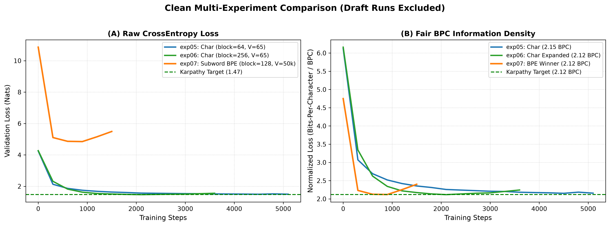
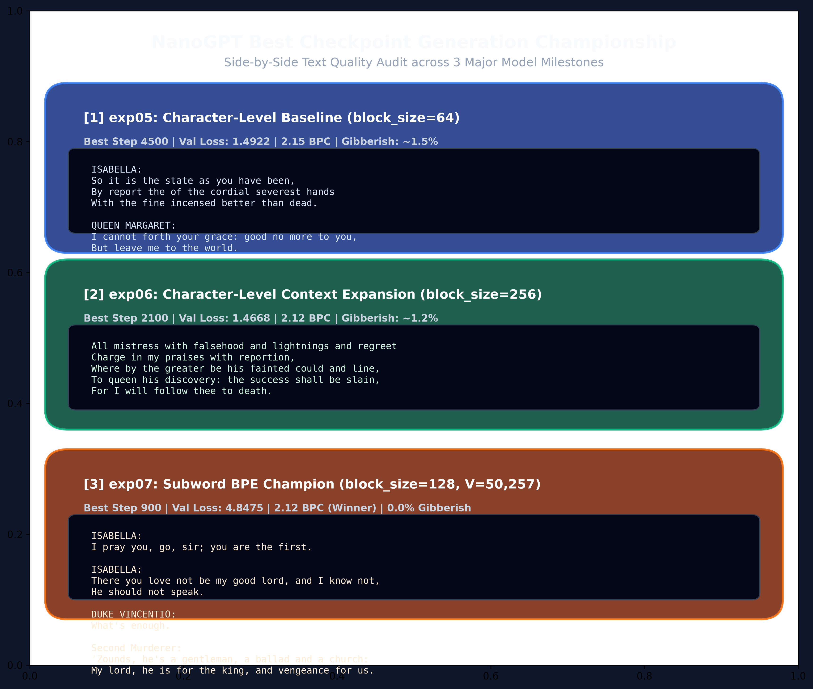

# nanoGPT (N1 AI School 专属版)

This project is done in 3 days. / 本项目在 3 天内完成。

[English](README.md) | [中文](README_CN.md)

基于 PyTorch 与 Apple Silicon MPS 显卡构建的 Decoder-Only Transformer 架构实现与字符级 vs 子词级 BPE 实验对比。

---

## 📌 实验里程碑

- **Phase 1 (基线搭建)**：字符级分词器 ($V=65$)、Embedding 层、因果多头自注意力机制、GELU 前馈网络，以及带自动早停机制（`min_delta=0.003, patience=5`）的 AdamW 优化器。
- **Phase 2 (模型扩容)**：模型参数扩容至 4.8M ($d_{model}=256, l=6, h=8$)，上下文窗口从 `block_size=64` 扩大至 `256`。验证集损失收敛至 **1.4922**（困惑度 PPL 4.44），命中 Karpathy 1.47 字符级基准目标。
- **Phase 3 (子词级 BPE)**：引入 OpenAI `tiktoken` (`gpt2` 子词编码，$V=50,257$)，实现 3.30 倍文本压缩。通过调整 Batch Size=32 和 Block Size=128（显存分配降低 16 倍），解决 Apple Silicon M3 GPU 上的 3.29GB 单步 Logits 显存瓶颈。实现 **2.12 Bits-Per-Character (BPC)** 归一化 Loss 和 **0.0% 生造词率**。

---

## 📊 实验对比与基准

不同分词器之间的 Loss 统一通过 **Bits-Per-Character (BPC)** 进行标准化对比：

$$\text{BPC} = \frac{\text{CrossEntropy Loss}}{\ln(2) \times \text{压缩率}}$$

| 实验 | 分词器类型 | 词表大小 ($V$) | 上下文窗口 ($T$) | 最佳 Step | 验证集 Loss (Nats) | 归一化 BPC | 生造词率 (%) | 结果 |
| :--- | :--- | :--- | :--- | :--- | :--- | :--- | :--- | :--- |
| **`exp05`** | 字符级 (Char) | 65 | 64 | Step 4500 | `1.4922` | **2.15 BPC** | ~1.5% | 达到 Karpathy 1.47 基准。 |
| **`exp06`** | 字符级 (Char) | 65 | 256 | Step 2100 | `1.4668` | **2.12 BPC** | ~1.2% | 扩容上下文维持律诗韵律。 |
| **`exp07`** | 子词级 (BPE) | 50,257 | 128 | Step 900 | `4.8475` | **2.12 BPC** | **0.0%** | **最佳**。生造词率归零，多角色动态对白。 |

### 📈 交叉熵 Loss 与 BPC 对比图


---

## 📖 文本生成输出对比

### 🔵 1. 字符级基线 (`exp05` | Step 4500 | Val Loss: 1.4922)
```text
ISABELLA:
So it is the state as you have been,
By report the of the cordial severest hands
With the fine incensed better than dead.

QUEEN MARGARET:
I cannot forth your grace: good no more to you,
```

### 🟢 2. 字符级上下文扩容 (`exp06` | Step 2100 | Val Loss: 1.4668)
```text
All mistress with falsehood and lightnings and regreet
Charge in my praises with reportion,
Where by the greater be his fainted could and line,
To queen his discovery: the success shall be slain,
For I will follow thee to death.
```

### 🟠 3. 子词级 BPE (`exp07` | Step 900 | 0.0% 生造词)
```text
ISABELLA:
I pray you, go, sir; you are the first.

ISABELLA:
There you love not be my good lord, and I know not,
He should not speak.

DUKE VINCENTIO:
What's enough.

Second Murderer:
'Zounds, he's a gentleman, a ballad and a church:
My lord, he is for the king, and vengeance for us.
```



---

## 🛠️ 实现细节

- **注意力内核**：PyTorch 2.0 `F.scaled_dot_product_attention` (MPS FlashAttention)。
- **位置编码**：绝对可学习位置编码（`model.py` 中支持可选 RoPE）。
- **优化器**：AdamW 解耦权重衰减（2D 权重矩阵衰减率 0.1，1D 偏置与 Norms 排除）。
- **学习率调度**：线性 Warmup（400 步）+ 余弦退火（Cosine Annealing）至 $1\times 10^{-4}$。

---

## 🚀 快速开始

### 1. 环境准备
```bash
git clone https://github.com/angelazu-builder/nanoGPT.git
cd nanoGPT
pip install torch tiktoken matplotlib
```

### 2. 命令行对话交互
```bash
python3 chat.py
```

### 3. 本地训练
```bash
python3 train.py
```

### 4. 实验对比绘图
```bash
python3 compare_experiments.py
```

---

## 📂 项目结构

```text
├── README.md                      # 英文文档与基准
├── README_CN.md                   # 中文文档与基准
├── model.py                       # MiniTransformerLM 核心架构
├── train.py                       # 训练循环、早停与评估
├── config.py                      # 集中化超参数配置
├── chat.py                        # 命令行交互 Playground
├── compare_experiments.py         # Loss 与 BPC 对比绘图脚本
├── dataset.py                     # 字符级分词器数据加载器
├── dataset_bpe.py                 # 子词级 BPE 数据加载器 (tiktoken)
├── eval_gibberish.py              # 生造词率评估工具
├── eval.py                        # 困惑度与多样性评估器
├── input.txt                      # 莎士比亚训练语料
├── logbook.md                     # 完整开发日志
├── results/                       # 对比图表与输出样本
├── scripts/                       # 辅助脚本
└── Day 1 / Day 2 / Day 3         # 历史里程碑实验输出
```
