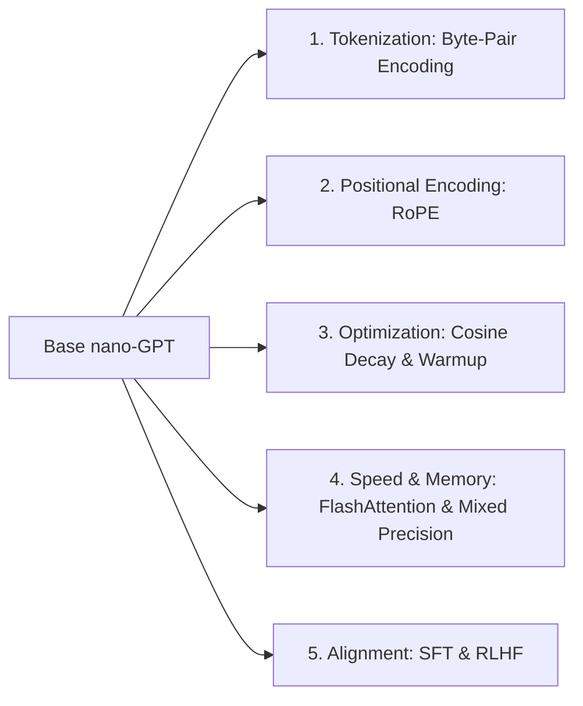

# Course Handout: The Theoretical Minimum of nano-GPT
**Course Level**: Intro to Computer Science & Artificial Intelligence (First CS Course)  
**Based on**: Andrej Karpathy's *nanoGPT Lecture ("Let's build GPT: from scratch, in code, spelled out.")*  
**Objective**: Master the theoretical fundamentals of Generative Pre-trained Transformers (GPT), understand the full data and model infrastructure, write/train a 10M-parameter nano-GPT from scratch, and implement modern architectural improvements.

---

## Table of Contents
1. [Introduction: What is a Language Model?](#1-introduction-what-is-a-language-model)
2. [Core Definitions & CS Beginner Cheatsheet](#2-core-definitions--cs-beginner-cheatsheet)
3. [The Data Pipeline & Representation](#3-the-data-pipeline--representation)
4. [Step-by-Step Architecture Evolution](#4-step-by-step-architecture-evolution)
   - [Stage 1: The Bigram Baseline](#stage-1-the-bigram-baseline)
   - [Stage 2: Naive Context Averaging](#stage-2-naive-context-averaging)
   - [Stage 3: Scaled Self-Attention (Query, Key, Value)](#stage-3-scaled-self-attention-query-key-value)
   - [Stage 4: Multi-Head Attention & Feed-Forward Networks](#stage-4-multi-head-attention--feed-forward-networks)
   - [Stage 5: Deep Transformer (Residuals & LayerNorm)](#stage-5-deep-transformer-residuals--layernorm)
5. [Infrastructure & The Training Loop](#5-infrastructure--the-training-loop)
6. [Complete Code Blueprint with Tensor Shapes](#6-complete-code-blueprint-with-tensor-shapes)
7. [Where Can It Be Improved? (Upgrades & Fine-Tuning)](#7-where-can-it-be-improved-upgrades--fine-tuning)
8. [Student Hands-On Exercises & Challenge Problems](#8-student-hands-on-exercises--challenge-problems)

---

## 1. Introduction: What is a Language Model?

At its core, a **Large Language Model (LLM)** like ChatGPT is a **probabilistic next-token predictor**. 

> [!NOTE]  
> **The Core Task**: Given a sequence of text characters/words $x_1, x_2, \dots, x_t$, predict the probability distribution over the vocabulary for the very next item $x_{t+1}$.

```
Input Sequence:  "To be, or not to "
Model Prediction: "b" (Probability: 84%), "b" -> "e" -> " " -> "b" -> "e" ...
```

### The Two Stages of Modern LLMs
1. **Pre-training (Raw Language Modeling)**: Train a massive neural network on trillions of text tokens from the internet (or Tiny Shakespeare). The model learns grammar, facts, reasoning, and world knowledge simply by completing sequences. *The model is an unaligned document completer.*
2. **Fine-Tuning & Alignment (Instruction & RLHF)**: Align the pre-trained model to respond like a helpful, safe AI assistant using Supervised Fine-Tuning (SFT) and Reinforcement Learning from Human Feedback (RLHF).

In this handout, we build the **Pre-training Engine (nano-GPT)**.

---

## 2. Core Definitions & CS Beginner Cheatsheet

If this is your first CS course, here are the essential building blocks:

| Term | Simple Analogy / Definition | Tensor Representation |
| :--- | :--- | :--- |
| **Token** | The atomic unit of text (a character, sub-word, or byte). | Integer ID e.g., `'a' \to 10` |
| **Vocabulary ($V$)** | The total set of all unique tokens known by the model. | Size $V$ (e.g., $V = 65$ for Shakespeare) |
| **Tensor** | A multi-dimensional grid of numbers (Vector = 1D, Matrix = 2D, Tensor = 3D+). | e.g. `(B, T, C)` |
| **Batch Size ($B$)** | Number of independent text sequences processed at the exact same time on GPU. | Dim 0 of Tensor |
| **Block Size / Context ($T$)** | Maximum sequence length (time steps) the model can look back into the past. | Dim 1 of Tensor |
| **Embedding Size ($C$)** | The number of feature numbers used to represent a single token inside the model. | Dim 2 of Tensor (also called $d_{model}$) |
| **Logits** | Raw, unnormalized scores produced by the neural network for each token in $V$. | Shape `(B, T, V)` |
| **Softmax** | A mathematical function that converts raw scores into probabilities that sum to 1.0. | $\sigma(z)_i = \frac{e^{z_i}}{\sum e^{z_j}}$ |
| **Cross-Entropy Loss** | A measure of how "surprised" the model is by the correct next token. Lower is better. | $\mathcal{L} = -\ln(P_{correct})$ |

> [!TIP]
> **Theoretical Loss Baseline**: If a model makes completely random guesses across 65 characters, the expected initial loss is:
> $$\mathcal{L}_{\text{initial}} = -\ln\left(\frac{1}{65}\right) \approx 4.17$$
> Any loss score lower than $4.17$ means your model is learning pattern structure!

---

## 3. The Data Pipeline & Representation

```
Raw Text File ("input.txt")
  │
  ▼ [Tokenizer: String <-> Int]
Integer List: [18, 47, 56, 57, 58, 1, 15, ...]
  │
  ▼ [Train/Val Split (90% / 10%)]
Train Data (0.99M chars) | Val Data (0.11M chars)
  │
  ▼ [Batch Extraction]
Input X: (B, T)  ==> Target Y: (B, T) [Shifted by 1 position]
```

### Why Target $Y$ is Shifted by +1 Position
Inside a single chunk of length $T$ (e.g., $T=8$), there are actually **$T$ individual training examples**:

Given input context $X[:i]$, predict target $Y[i]$:
- Context: `[18]` $\rightarrow$ Target: `47`
- Context: `[18, 47]` $\rightarrow$ Target: `56`
- Context: `[18, 47, 56]` $\rightarrow$ Target: `57`
- ... up to length $T$.

This design allows the GPU to compute $T$ predictions simultaneously inside one forward pass!

---

## 4. Step-by-Step Architecture Evolution

We build nano-GPT by gradually evolving from a zero-context lookup table to a deep multi-head Transformer.

```mermaid
flowchart TD
    A[Raw Input Tokens (B,T)] --> B[Stage 1: Bigram Model\nNo context lookup table]
    B --> C[Stage 2: Naive Averaging\nUniform context blending]
    C --> D[Stage 3: Scaled Self-Attention\nQueries, Keys, Values]
    D --> E[Stage 4: Multi-Head & Feed-Forward\nParallel attention + MLP thinking]
    E --> F[Stage 5: Deep Transformer\nResiduals + LayerNorm + Dropout]
```

---

### Stage 1: The Bigram Baseline
The simplest language model uses **only the immediate current character** to guess the next character. It completely ignores all characters before it.

- **Mechanism**: A single lookup table of size $(V, V)$.
- **PyTorch Layer**: `nn.Embedding(vocab_size, vocab_size)`
- **Validation Loss**: $\approx 2.50$ (Better than random $4.17$, but generates gibberish).

---

### Stage 2: Naive Context Averaging
To predict token $t$, we want information from previous tokens $0, 1, \dots, t-1$. The simplest way to gather history is to **average their feature vectors**.

To prevent looking into the future (causal mask), we use a lower-triangular matrix:

$$\text{Masked Average}: \quad A_{ij} = \begin{cases} \frac{1}{i+1} & \text{if } j \le i \\ 0 & \text{if } j > i \end{cases}$$

```python
# Triangular averaging in PyTorch
wei = torch.tril(torch.ones(T, T))
wei = wei / wei.sum(1, keepdim=True)
x_avg = wei @ x # (T, T) @ (B, T, C) -> (B, T, C)
```
*Problem with Naive Averaging*: All past tokens are treated equally! A vowel 5 steps ago has the exact same weight as the crucial verb right next to it.

---

### Stage 3: Scaled Self-Attention (Query, Key, Value)

**Self-Attention** allows tokens to *data-dependently* determine which past tokens are most relevant.

Every token at position $i$ emits 3 vectors:
1. **Query ($Q$)**: What am I looking for?
2. **Key ($K$)**: What information do I contain?
3. **Value ($V$)**: If you attend to me, what content do I pass to you?

```
Token X (B, T, C)
  ├──> Linear_q (C, Head_Size) ──> Query Q (B, T, head_size)
  ├──> Linear_k (C, Head_Size) ──> Key K   (B, T, head_size)
  └──> Linear_v (C, Head_Size) ──> Value V (B, T, head_size)
```

#### Attention Formula
$$W_{att} = \text{Softmax}\left( \frac{Q K^T}{\sqrt{d_k}} + \text{Mask} \right) V$$

```python
# Scaled Dot-Product Self-Attention
k = self.key(x)   # (B, T, head_size)
q = self.query(x) # (B, T, head_size)

# Compute attention affinities ("raw scores")
wei = q @ k.transpose(-2, -1) * (head_size ** -0.5) # (B, T, T)

# Apply Causal Mask (prevent looking into future)
wei = wei.masked_fill(self.tril[:T, :T] == 0, float('-inf'))
wei = F.softmax(wei, dim=-1) # Normalize probabilities

# Weighted aggregation of values
v = self.value(x) # (B, T, head_size)
out = wei @ v    # (B, T, head_size)
```

> [!IMPORTANT]
> **Why divide by $\sqrt{d_k}$?**  
> If $Q$ and $K$ have unit variance, their dot product $Q \cdot K^T$ will have a variance of $d_k$. For large dimensions, large dot products push the `Softmax` function into extreme saturated regions (one-hot distributions with zero gradients). Scaling by $\sqrt{d_k}$ preserves unit variance and smooth gradient flow!

---

### Stage 4: Multi-Head Attention & Feed-Forward Networks

#### 1. Multi-Head Attention
Instead of one big attention head, we run $h$ smaller heads in parallel and concatenate their results:
$$\text{MultiHead}(X) = \text{Concat}(\text{head}_1, \text{head}_2, \dots, \text{head}_h) W^O$$
*Intuition*: Different heads focus on different relationships (e.g., Head 1 tracks grammar/syntax, Head 2 tracks noun-pronoun references, Head 3 tracks punctuation).

#### 2. Feed-Forward Network (FFN)
After tokens gather context via attention, they need time to "think" individually. A simple 2-layer MLP is applied to every token position independently:

$$\text{FFN}(x) = \text{ReLU}(x W_1 + b_1) W_2 + b_2$$

---

### Stage 5: Deep Transformer (Residuals & LayerNorm)

When stacking many Transformer layers (e.g., 6 or 12 blocks), deep networks suffer from **vanishing/exploding gradients**. We solve this using two critical innovations:

```
          Input x
             │
      ┌──────┴──────┐
      │             ▼
      │     LayerNorm(x)
      │             ▼
      │    Multi-Head Attention
      │             ▼
      └──────────> (+)  <-- Residual Addition (Gradient Highway)
                    │
      ┌─────────────┴──────┐
      │                    ▼
      │            LayerNorm(x)
      │                    ▼
      │           Feed-Forward MLP
      │                    ▼
      └─────────────────> (+)  <-- Residual Addition
                    │
                    ▼
               Next Block
```

1. **Residual Connections (Skip Connections)**:
   Add the input directly to the output: $x = x + \text{SubLayer}(x)$. This creates an unimpeded gradient highway during backpropagation.
2. **Pre-Layer Normalization (Pre-LN)**:
   Normalize feature activations across channels *before* feeding into Attention or FFN blocks. Maintains stable activation standard deviations.

---

## 5. Infrastructure & The Training Loop

Training a GPT model follows a deterministic loop in PyTorch:

```
     ┌───────────────────────────────────────────────┐
     │ 1. Sample Random Batch (X, Y) from Training Set│
     └──────────────────────┬────────────────────────┘
                            ▼
     ┌───────────────────────────────────────────────┐
     │ 2. Forward Pass: Compute Logits & Loss        │
     └──────────────────────┬────────────────────────┘
                            ▼
     ┌───────────────────────────────────────────────┐
     │ 3. Zero Gradients: optimizer.zero_grad()       │
     └──────────────────────┬────────────────────────┘
                            ▼
     ┌───────────────────────────────────────────────┐
     │ 4. Backward Pass: loss.backward()             │
     └──────────────────────┬────────────────────────┘
                            ▼
     ┌───────────────────────────────────────────────┐
     │ 5. Optimizer Step: optimizer.step() (AdamW)   │
     └───────────────────────────────────────────────┘
```

### Hyperparameters Summary (nano-GPT)
- `vocab_size` = 65
- `n_embd` ($C$) = 384
- `n_head` = 6 (head_size = $384 / 6 = 64$)
- `n_layer` = 6
- `block_size` ($T$) = 256
- `batch_size` ($B$) = 64
- `learning_rate` = `3e-4`
- Total Parameters: **~10 Million**

---

## 6. Complete Code Blueprint with Tensor Shapes

Here is the complete, self-contained PyTorch implementation of nano-GPT:

```python
import torch
import torch.nn as nn
from torch.nn import functional as F

# Hyperparameters
batch_size = 64      # How many independent sequences in parallel? (B)
block_size = 256     # Maximum context length for predictions? (T)
max_iters = 5000
eval_interval = 500
learning_rate = 3e-4
device = 'cuda' if torch.cuda.is_available() else 'cpu'
eval_iters = 200
n_embd = 384         # Embedding dimension (C)
n_head = 6           # Number of attention heads
n_layer = 6          # Number of Transformer blocks
dropout = 0.2        # Dropout probability

torch.manual_seed(1337)

# --- 1. DATA PIPELINE ---
with open('input.txt', 'r', encoding='utf-8') as f:
    text = f.read()

chars = sorted(list(set(text)))
vocab_size = len(chars)
stoi = { ch:i for i,ch in enumerate(chars) }
itos = { i:ch for i,ch in enumerate(chars) }
encode = lambda s: [stoi[c] for c in s]
decode = lambda l: ''.join([itos[i] for i in l])

data = torch.tensor(encode(text), dtype=torch.long)
n = int(0.9 * len(data))
train_data = data[:n]
val_data = data[n:]

def get_batch(split):
    data_split = train_data if split == 'train' else val_data
    ix = torch.randint(len(data_split) - block_size, (batch_size,))
    x = torch.stack([data_split[i:i+block_size] for i in ix])
    y = torch.stack([data_split[i+1:i+block_size+1] for i in ix])
    return x.to(device), y.to(device)

@torch.no_grad()
def estimate_loss(model):
    out = {}
    model.eval()
    for split in ['train', 'val']:
        losses = torch.zeros(eval_iters)
        for k in range(eval_iters):
            X, Y = get_batch(split)
            logits, loss = model(X, Y)
            losses[k] = loss.item()
        out[split] = losses.mean()
    model.train()
    return out

# --- 2. ARCHITECTURE COMPONENTS ---

class Head(nn.Module):
    """ One Single Head of Scaled Self-Attention """
    def __init__(self, head_size):
        super().__init__()
        self.key = nn.Linear(n_embd, head_size, bias=False)
        self.query = nn.Linear(n_embd, head_size, bias=False)
        self.value = nn.Linear(n_embd, head_size, bias=False)
        self.register_buffer('tril', torch.tril(torch.ones(block_size, block_size)))
        self.dropout = nn.Dropout(dropout)

    def forward(self, x):
        # Input shape: (B, T, C)
        B, T, C = x.shape
        k = self.key(x)   # (B, T, head_size)
        q = self.query(x) # (B, T, head_size)
        
        # Compute affinities
        wei = q @ k.transpose(-2,-1) * (k.shape[-1]**-0.5) # (B, T, T)
        wei = wei.masked_fill(self.tril[:T, :T] == 0, float('-inf'))
        wei = F.softmax(wei, dim=-1)
        wei = self.dropout(wei)
        
        # Perform weighted aggregation
        v = self.value(x) # (B, T, head_size)
        out = wei @ v     # (B, T, head_size)
        return out

class MultiHeadAttention(nn.Module):
    """ Multiple Attention Heads in Parallel """
    def __init__(self, num_heads, head_size):
        super().__init__()
        self.heads = nn.ModuleList([Head(head_size) for _ in range(num_heads)])
        self.proj = nn.Linear(head_size * num_heads, n_embd)
        self.dropout = nn.Dropout(dropout)

    def forward(self, x):
        out = torch.cat([h(x) for h in self.heads], dim=-1) # (B, T, C)
        out = self.dropout(self.proj(out))
        return out

class FeedForward(nn.Module):
    """ Position-Wise Feed-Forward Network """
    def __init__(self, n_embd):
        super().__init__()
        self.net = nn.Sequential(
            nn.Linear(n_embd, 4 * n_embd),
            nn.ReLU(),
            nn.Linear(4 * n_embd, n_embd),
            nn.Dropout(dropout),
        )

    def forward(self, x):
        return self.net(x)

class Block(nn.Module):
    """ Transformer Block: Communication followed by Computation """
    def __init__(self, n_embd, n_head):
        super().__init__()
        head_size = n_embd // n_head
        self.sa = MultiHeadAttention(n_head, head_size)
        self.ffwd = FeedForward(n_embd)
        self.ln1 = nn.LayerNorm(n_embd)
        self.ln2 = nn.LayerNorm(n_embd)

    def forward(self, x):
        # Pre-LN Residual Connections
        x = x + self.sa(self.ln1(x))
        x = x + self.ffwd(self.ln2(x))
        return x

class GPTLanguageModel(nn.Module):
    def __init__(self):
        super().__init__()
        self.token_embedding_table = nn.Embedding(vocab_size, n_embd)
        self.position_embedding_table = nn.Embedding(block_size, n_embd)
        self.blocks = nn.Sequential(*[Block(n_embd, n_head=n_head) for _ in range(n_layer)])
        self.ln_f = nn.LayerNorm(n_embd)
        self.lm_head = nn.Linear(n_embd, vocab_size)

        self.apply(self._init_weights)

    def _init_weights(self, module):
        if isinstance(module, nn.Linear):
            torch.nn.init.normal_(module.weight, mean=0.0, std=0.02)
            if module.bias is not None:
                torch.nn.init.zeros_(module.bias)
        elif isinstance(module, nn.Embedding):
            torch.nn.init.normal_(module.weight, mean=0.0, std=0.02)

    def forward(self, idx, targets=None):
        B, T = idx.shape
        tok_emb = self.token_embedding_table(idx) # (B, T, C)
        pos_emb = self.position_embedding_table(torch.arange(T, device=device)) # (T, C)
        x = tok_emb + pos_emb # (B, T, C)
        x = self.blocks(x)    # (B, T, C)
        x = self.ln_f(x)      # (B, T, C)
        logits = self.lm_head(x) # (B, T, vocab_size)

        if targets is None:
            loss = None
        else:
            B, T, C = logits.shape
            logits = logits.view(B*T, C)
            targets = targets.view(B*T)
            loss = F.cross_entropy(logits, targets)

        return logits, loss

    def generate(self, idx, max_new_tokens):
        for _ in range(max_new_tokens):
            idx_cond = idx[:, -block_size:] # Crop context
            logits, loss = self(idx_cond)
            logits = logits[:, -1, :] # Focus on last time step -> (B, C)
            probs = F.softmax(logits, dim=-1) # (B, C)
            idx_next = torch.multinomial(probs, num_samples=1) # (B, 1)
            idx = torch.cat((idx, idx_next), dim=1) # (B, T+1)
        return idx

# --- 3. TRAINING EXECUTION ---
model = GPTLanguageModel().to(device)
optimizer = torch.optim.AdamW(model.parameters(), lr=learning_rate)

for iter in range(max_iters):
    if iter % eval_interval == 0 or iter == max_iters - 1:
        losses = estimate_loss(model)
        print(f"step {iter}: train loss {losses['train']:.4f}, val loss {losses['val']:.4f}")

    xb, yb = get_batch('train')
    logits, loss = model(xb, yb)
    optimizer.zero_grad(set_to_none=True)
    loss.backward()
    optimizer.step()

# --- 4. TEXT GENERATION DEMO ---
context = torch.zeros((1, 1), dtype=torch.long, device=device)
print(decode(model.generate(context, max_new_tokens=500)[0].tolist()))
```

---

## 7. Where Can It Be Improved? (Upgrades & Fine-Tuning)

Once your base nano-GPT is running, here are the core directions to bring it to state-of-the-art:



### 1. Advanced Tokenization (Subword / BPE)
- **Current**: Character-level (Vocab size 65). Long sequence length, low semantics per token.
- **Improvement**: Use **Byte-Pair Encoding (BPE)** via OpenAI's `tiktoken` (Vocab size 50,257). Compresses sequence length by $\sim 3\times$, allowing the model to see much more text in the same context window.

### 2. Rotary Positional Embeddings (RoPE)
- **Current**: Absolute positional embedding lookup table (`position_embedding_table`).
- **Improvement**: Use **RoPE (Rotary Position Embeddings)** used in LLaMA. Rotates Query and Key vectors in complex space based on relative distance, giving far superior generalization to context lengths unseen during training.

### 3. Learning Rate Scheduler (Cosine Decay with Warmup)
- **Current**: Constant learning rate `3e-4`.
- **Improvement**: Linear warmup for the first 2,000 steps, followed by Cosine Decay down to $10\%$ of max learning rate. Prevents early gradient instability and leads to lower final loss.

### 4. Hardware Optimization & Acceleration
- **PyTorch 2.0 Compiler**: Wrap model in `model = torch.compile(model)` to fuse kernel operations and speed up execution by $30-50\%$.
- **FlashAttention**: Replace manual `q @ k.T` with `torch.nn.functional.scaled_dot_product_attention`, which avoids writing intermediate $(T, T)$ matrices to GPU HBM.
- **Mixed Precision (`autocast`)**: Train in `bfloat16` or `float16` to halve memory footprint and utilize GPU Tensor Cores.

### 5. Instruction Fine-Tuning (SFT) & Alignment
- **Current**: Pre-trained model completes Shakespeare text.
- **Improvement**:
  1. **Supervised Fine-Tuning (SFT)**: Train on Prompt-Response pairs (e.g., Alpaca/Vicuna datasets).
  2. **DPO / RLHF**: Direct Preference Optimization to align model outputs with human preference ratings.

---

## 8. Student Hands-On Exercises & Challenge Problems

### Exercise 1: Empirical Loss Verification (Easy)
Write a script to compute the theoretical zero-knowledge cross-entropy loss for a dataset with vocabulary size $V$. Verify that your untrained nano-GPT model output matches this initial theoretical loss within $\pm 0.05$.

### Exercise 2: Temperature & Top-K Sampling (Medium)
Modify the `generate()` method in `GPTLanguageModel` to accept two new parameters:
- `temperature`: Scales logits before softmax (`logits / temperature`). Test values `0.2`, `0.7`, and `1.5`. What happens to text creativity vs gibberish?
- `top_k`: Filters logits to keep only the $k$ highest probability tokens before sampling.

### Exercise 3: Weight Decay & Optimizer Split (Hard)
Implement the OpenAI GPT-2 weight decay strategy: apply `weight_decay = 0.1` to all 2D matrix weight tensors (Linear layers), but **exclude** 1D biases and LayerNorm parameters. Observe the impact on validation loss over 10,000 iterations.

---

### Quick Reference Formula Cheat Sheet
- **Scaled Attention Score**: $\text{Attention}(Q,K,V) = \text{softmax}\left(\frac{QK^T}{\sqrt{d_k}}\right)V$
- **Total Parameters Approx**: $\text{Params} \approx 12 \cdot n_{layer} \cdot d_{model}^2$
- **Memory per Token**: $\mathcal{O}(T^2)$ for standard attention vs $\mathcal{O}(T)$ for FlashAttention.
