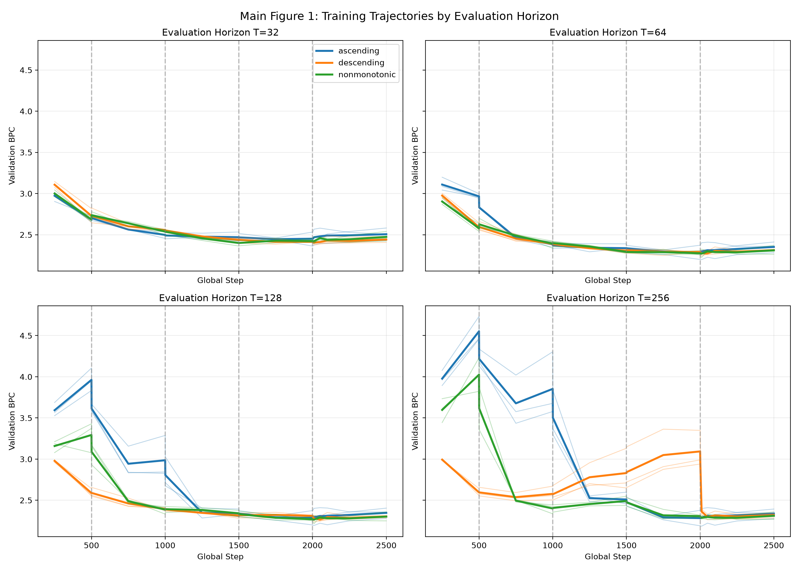
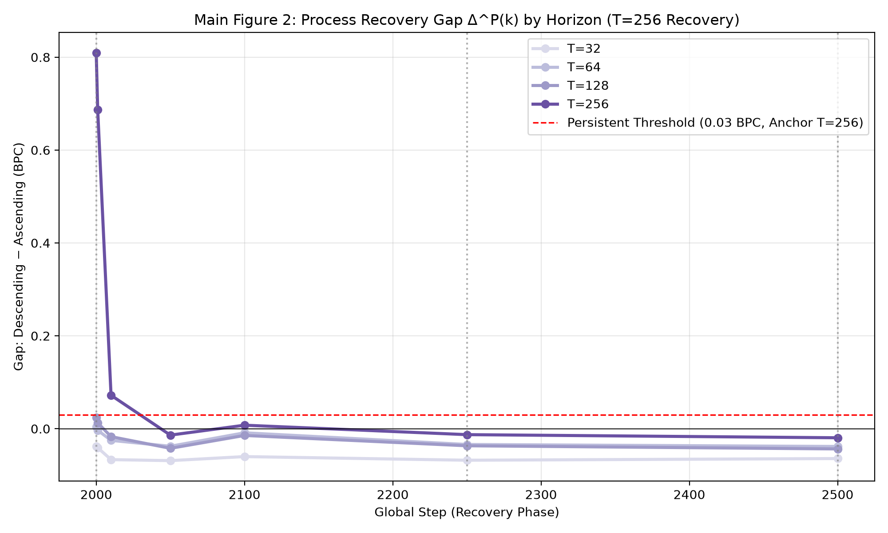
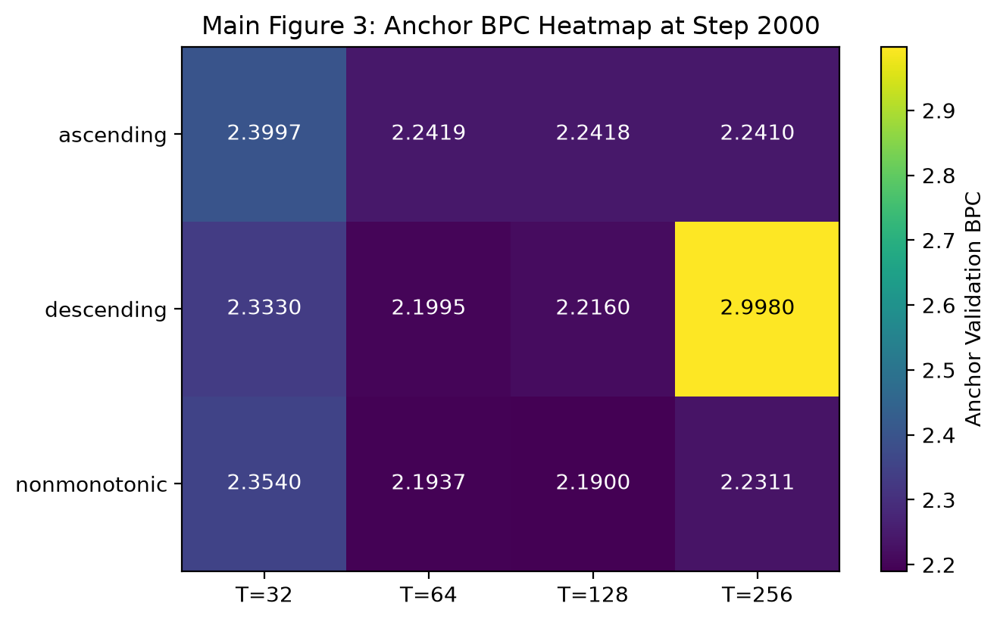
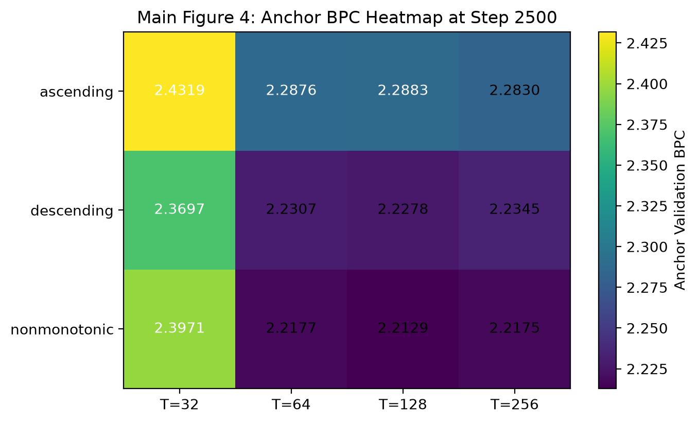
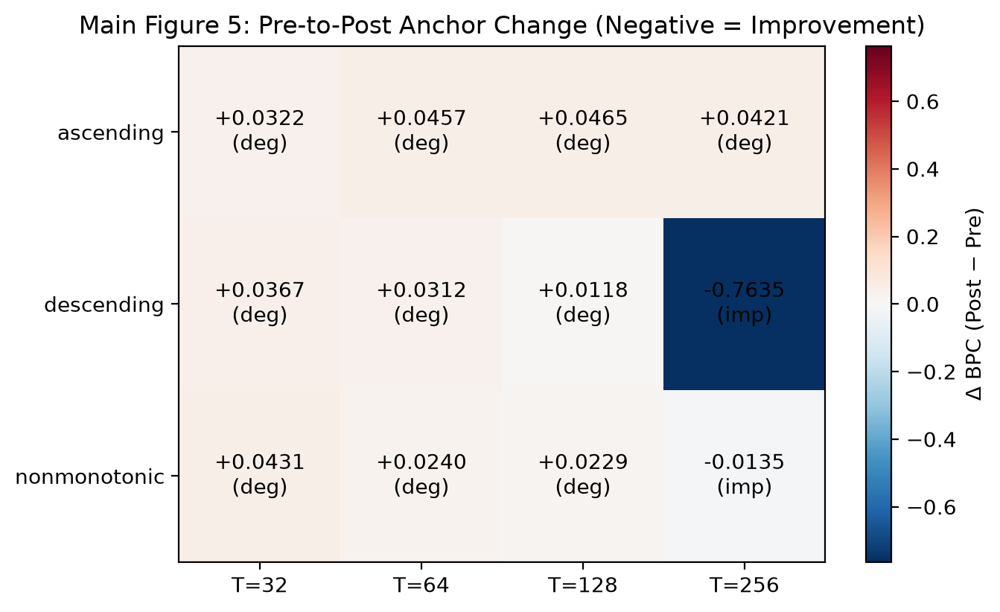
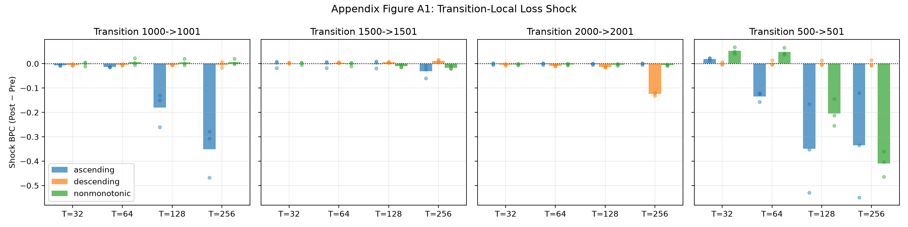
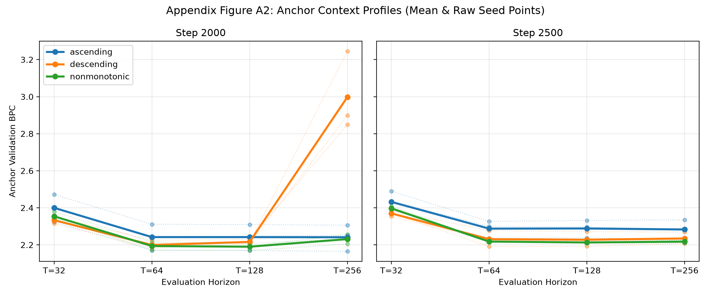
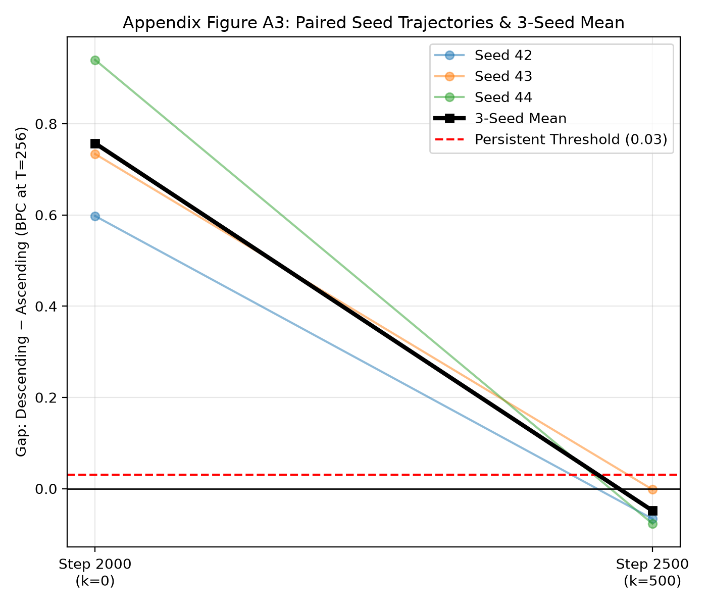
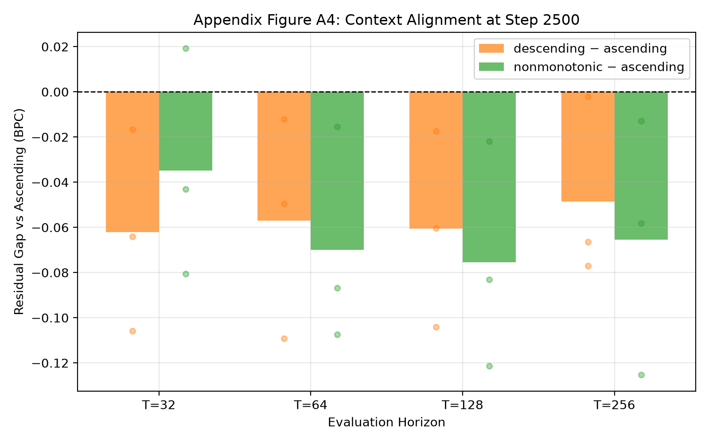
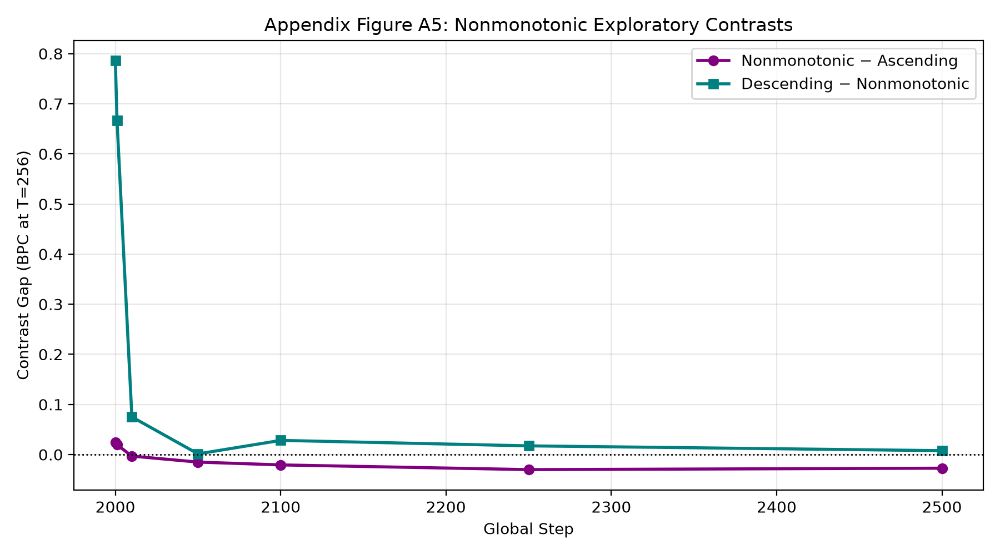

# Context-Length Order Recovery Study

Execution implementation for the preregistered study:
`training_dynamics_research/recovery_study/PREREGISTRATION.md` (Frozen commit: `f1bf7b7`).

---

## Directory Structure

```text
training_dynamics_research/recovery_study/
├── PREREGISTRATION.md   # Frozen experimental specification & decision rules
├── PREREGISTRATION_AMENDMENT_001_FIGURES.md
├── TECHNICAL_REPORT_final.md  # Final results, process, interpretation, and provenance
├── config.py            # Global hyperparameters, seeds, and decision thresholds
├── schedules.py         # Ascending, descending, and nonmonotonic schedule builders
├── manifests.py         # RNG-decoupled scheduled, recovery, & extended batch manifests
├── evaluation.py        # Zero-redundancy nested evaluation (process panel + anchor panel)
├── runner.py            # Execution runner with rotation, full state ckpts, & extension hook
├── analyze.py           # Multi-horizon statistical analysis, transition shock, AUC, & plots
├── paper_figures.py     # Post-results presentation layer; no new estimands or rules
├── test_study.py        # Unit tests covering manifests, schedules, & Case A-E decision rules
└── README.md            # This documentation
```

Outputs are automatically organized into:

```text
results/recovery_study/
├── run_config.json
├── validation_manifest.npz
├── seed_42/{ascending,descending,nonmonotonic}/
├── seed_43/{ascending,descending,nonmonotonic}/
├── seed_44/{ascending,descending,nonmonotonic}/
├── figures/
│   ├── data/            # Five canonical tidy CSV tables
│   ├── paper/
│   │   ├── v3_r2/       # Preserved first paper-quality draft
│   │   └── v3_r3/       # Current 3-main + 2-appendix manuscript set (PNG/PDF)
│   ├── main_01_*.png ... main_05_*.png
│   └── appendix_A1_*.png ... appendix_A5_*.png
└── summary.json
```

---

## Preregistered Figure Gallery

These are the complete formal figures frozen in `PREREGISTRATION_AMENDMENT_001_FIGURES.md` before the results were inspected. They are the study's audit figures, distinct from the later paper-presentation figures under `figures/paper/`. Full captions and interpretation appear in `TECHNICAL_REPORT_final.md`.

### Main Figure 1 — Training trajectories by evaluation horizon



### Main Figure 2 — Recovery gap by evaluation horizon



### Main Figure 3 — Anchor heatmap before recovery



### Main Figure 4 — Anchor heatmap after recovery



### Main Figure 5 — Pre-to-post anchor change



<details>
<summary><strong>Preregistered appendix figures A1–A5</strong></summary>

### Appendix Figure A1 — Transition-local shock



### Appendix Figure A2 — Context profiles



### Appendix Figure A3 — Paired seed endpoints



### Appendix Figure A4 — Context-alignment contrast



### Appendix Figure A5 — Nonmonotonic exploratory contrasts



</details>

---

## Quickstart & Execution Commands

### 1. Run Unit Tests (Schedules, Manifests, & Synthetic Decisions)

```bash
python3 -m unittest training_dynamics_research/recovery_study/test_study.py
```

### 2. Run Smoke Test (10 steps/block, 10 recovery steps, 1 seed)

```bash
python3 -m training_dynamics_research.recovery_study.runner --smoke-test
```

### 3. Run Full Formal Experiment (3 arms × 3 seeds = 9 runs)

```bash
python3 -m training_dynamics_research.recovery_study.runner
```

*CLI Options:*
- `--seed <int>`: Run only a specific seed (e.g. `--seed 42`)
- `--arm <str>`: Run only a specific arm (e.g. `--arm ascending`)
- `--overwrite`: Re-run and overwrite existing completed runs

### 4. Trigger Adaptive Extension (if Case D is met)

If `analyze.py` diagnoses Case D (active recovery, gap still decreasing):

```bash
python3 -m training_dynamics_research.recovery_study.runner --extend
```
This loads each arm's `checkpoint_step_2500.pt`, preserves Adam moments and RNG states, and extends training with clamped `min_lr = 1e-4` up to step 3000 using the preregistered `extended_recovery_manifest`.

### 5. Analyze Results & Generate Plots

```bash
python3 -m training_dynamics_research.recovery_study.analyze
```
Outputs the corrected preregistered summary, five tidy tables, the registered audit figures, and the post-results paper figure set under `results/recovery_study/figures/`. The interpretation and exact training/analysis/figure provenance are recorded in `TECHNICAL_REPORT_final.md`.
